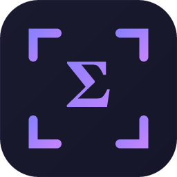

<p align="center">
  
</p>

<h1 align="center">Snigma</h1>

<p align="center">
  <strong>AI on your screen. Hotkey-fast.</strong><br/>
  Snap anything — a problem, a bug, a diagram — and get a sharp, instant answer.
</p>

<p align="center">
  <a href="https://github.com/protobuben/snigma/releases/latest">
    
  </a>
  
  
</p>

---

## What it does

Press a hotkey → drag a region (or click for the full screen) → get an AI answer in a floating chat window.

That's it. No alt-tabbing, no copy-pasting, no context switching. Snigma lives in your system tray and gets out of your way until you need it.

Works great for:
- Math and physics homework
- Debugging code on screen
- Reading dense docs or error messages
- Anything that's easier to show than describe

---

## Install

1. Go to the [**Releases**](https://github.com/protobuben/snigma/releases/latest) page
2. Download `Snigma_x.x.x_x64-setup.exe`
3. Run the installer — Windows may show a SmartScreen prompt, click **More info → Run anyway**
4. Snigma starts and appears in your system tray

> **Requires Windows 10 or later** (x64). WebView2 is bundled automatically.

---

## First-time setup

### 1. Get a license key

Snigma needs a license key to use the AI backend.

Get one at **[snigma.github.io](https://snigma.github.io)** — a free tier is available, paid plans unlock higher monthly limits.

### 2. Enter your key

Open the tray icon → the Snigma window appears → paste your key into the **License key** field → press Enter or click **Save**.

### 3. Set your hotkey

The default hotkey is **Alt + S**. You can change it in **Settings** to any combination that doesn't conflict with other apps.

### 4. Capture something

Press your hotkey → the screen dims with a crosshair overlay →
- **Drag** a region to focus on a specific area
- **Click** anywhere to capture the full screen

The AI chat window pops up. Type a question or just hit Enter to let the AI describe what it sees.

---

## Settings

| Setting | What it does |
|---|---|
| **License key** | Your Snigma subscription key |
| **Hotkey** | Global shortcut to trigger capture |
| **Theme** | Accent color used across the entire UI |
| **Language** | Speech recognition language |
| **Microphone** | Input device for voice questions |
| **Low performance mode** | Disables all idle animations — good for older hardware |
| **Launch at startup** | Start Snigma with Windows |

---

## Voice input

In the chat window, click the **mic button** next to the input field to ask a question by voice. The transcript fills the input automatically — review it and hit Send.

Set your preferred language and microphone in **Settings → Language / Microphone**.

---

## Tips

- **Follow-up questions are token-efficient** — the AI remembers the conversation, you don't need to re-snap.
- **Drag precisely** to help the AI focus on just the relevant part of the screen.
- **Click without dragging** for a full-screen grab — useful for general questions or when context matters.
- **Esc** cancels the overlay without sending anything.
- The chat window is **resizable** — drag any corner to make it bigger.

---

## Build from source

Requirements: [Rust](https://rustup.rs/) (stable), [Node.js](https://nodejs.org/) 18+, [Tauri CLI v2](https://tauri.app/)

```bash
git clone https://github.com/protobuben/snigma.git
cd snigma
npm install
npm run tauri dev       # dev mode
npm run tauri build     # production build → src-tauri/target/release/bundle/
```

The NSIS installer will be at `src-tauri/target/release/bundle/nsis/`.

---

## License

Source available. All rights reserved — see [LICENSE](LICENSE) for details.

---

<p align="center">Made with way too many hotkeys and not enough sleep.</p>
